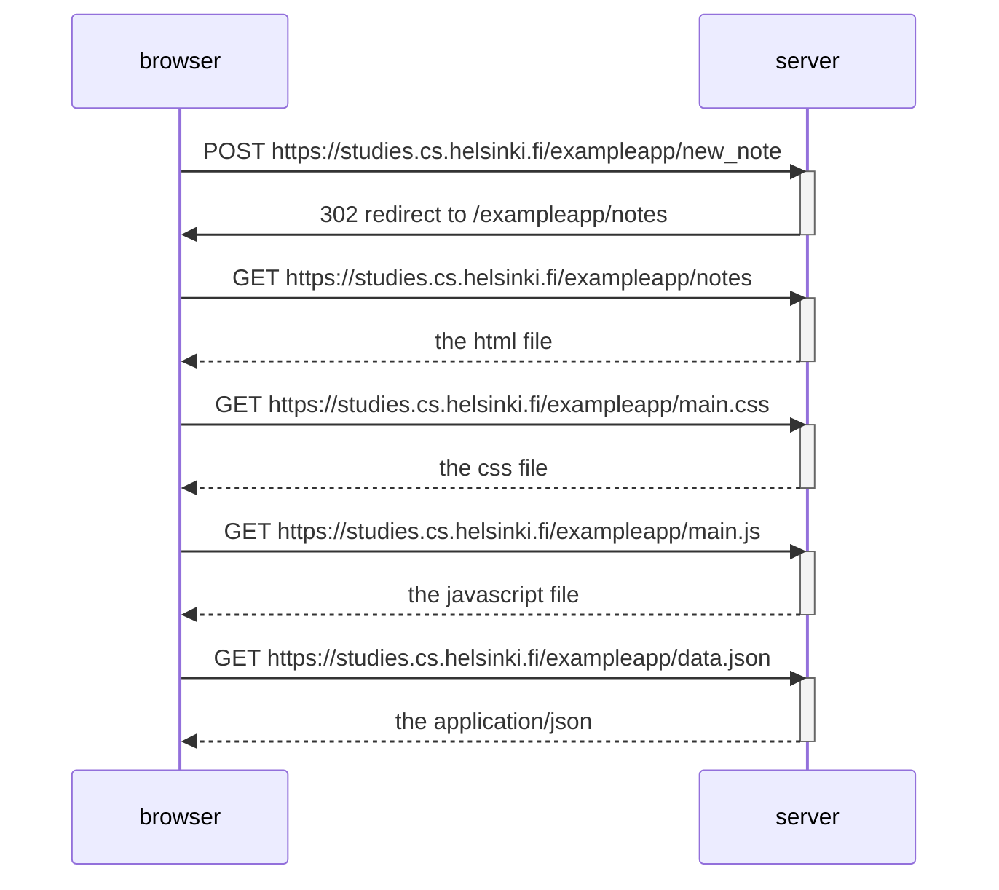

```mermaid
sequenceDiagram
participant browser 
participant server

 %%this happens when the save button is clicked
browser->>server: POST https://studies.cs.helsinki.fi/exampleapp/new_note
activate server
server->>browser: 302 redirect to /exampleapp/notes
deactivate server

%%after the redirect the browser requests the note.html file and the server provides 
browser->>server: GET https://studies.cs.helsinki.fi/exampleapp/notes
activate server
server-->>browser: the html file
deactivate server

%%after that the browser requests the main.css file and the server provides 
browser->>server: GET https://studies.cs.helsinki.fi/exampleapp/main.css
activate server
server-->>browser: the css file
deactivate server

%%after that the browser requests the main.js file and the server provides 
browser->>server: GET https://studies.cs.helsinki.fi/exampleapp/main.js
activate server
server-->>browser: the javascript file
deactivate server
%% after that the browser requests the data.json file and the server provides 
browser->>server: GET https://studies.cs.helsinki.fi/exampleapp/data.json
activate server
server-->>browser: the application/json 
deactivate server
```
