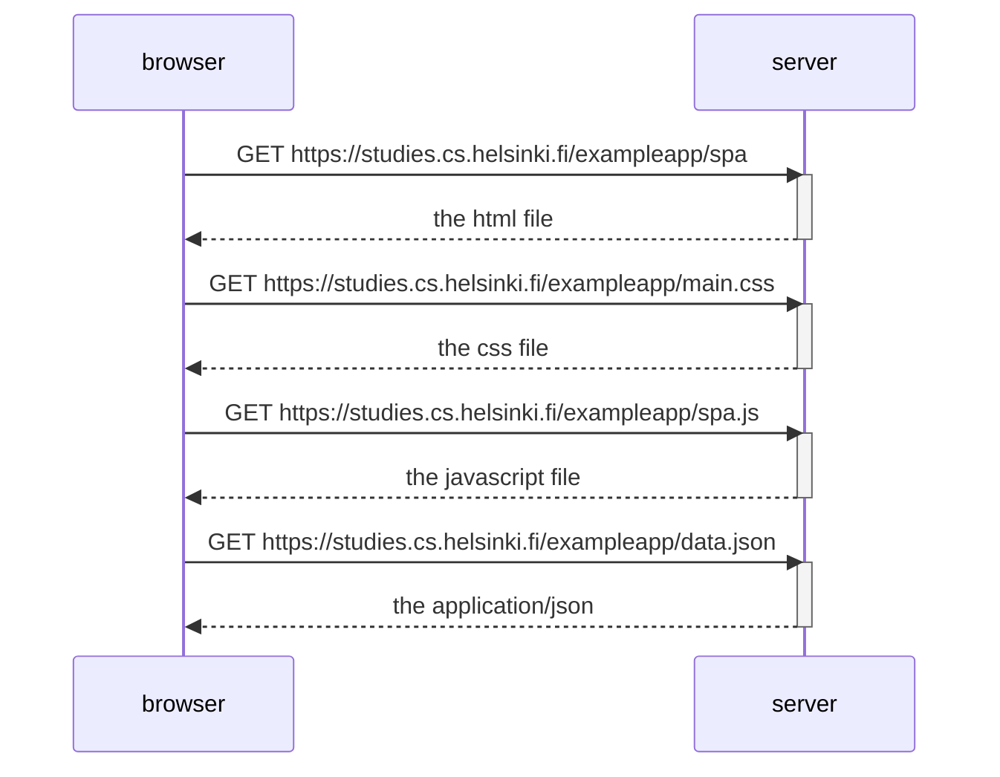

```mermaid
sequenceDiagram
participant browser 
participant server

 %%when the page loads the browser requests html file
browser->>server: GET https://studies.cs.helsinki.fi/exampleapp/spa
activate server
server-->>browser: the html file
deactivate server

%%after that the browser requests the main.css file and the server provides 
browser->>server: GET https://studies.cs.helsinki.fi/exampleapp/main.css
activate server
server-->>browser: the css file
deactivate server

%%after that the browser requests the spa.js file and the server provides 
browser->>server: GET https://studies.cs.helsinki.fi/exampleapp/spa.js
activate server
server-->>browser: the javascript file
deactivate server

%% after that the browser requests the data.json file and the server provides 
browser->>server: GET https://studies.cs.helsinki.fi/exampleapp/data.json
activate server
server-->>browser: the application/json 
deactivate server
```
